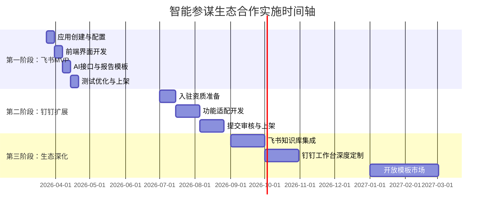

# 智能参谋企业诊断平台生态合作方案

## 摘要

本方案旨在明确智能参谋平台与字节跳动飞书、阿里巴巴钉钉两大企业生态平台的结合路径。通过对比分析两个平台的用户规模、入驻流程、API能力、审核周期等关键维度，制定分阶段接入策略，优先通过飞书开放平台实现快速冷启动，逐步扩展至钉钉生态，最大化利用平台流量降低获客成本。

**核心结论**：
1. **飞书优先策略**：入驻流程更简洁，审核周期更短（1-3天），更适合MVP快速验证；用户以互联网/科技/知识密集型行业为主，与智能参谋的“专业诊断”定位高度匹配。
2. **钉钉补充策略**：用户规模更大（2亿月活），覆盖传统行业更广，但入驻审核严格（1-3周），建议第二阶段跟进。
3. **技术实现要点**：采用WebSocket长连接模式简化部署，专注降本增效、韧性增长两大核心模块，通过飞书应用商店/钉钉工作台直接触达目标用户。

---

## 第一章：平台对比分析

### 1.1 核心维度对比表

| 对比维度 | 字节跳动飞书 | 阿里巴巴钉钉 | 对比结论 |
|---------|-------------|-------------|----------|
| **月活跃用户（MAU）** | 约3000万（2026年） | 约2亿（2026年） | 钉钉用户规模是飞书的6-7倍，覆盖更广 |
| **企业用户特征** | 互联网/科技/文化创意/知识密集型行业为主（蔚来、小米、理想、三一重工等） | 全行业覆盖，尤其在制造业、零售业、服务业等传统行业渗透深 | 飞书用户对AI工具接受度高，钉钉用户基数大但数字化转型程度不一 |
| **入驻流程复杂度** | **低**：创建企业自建应用 → 配置权限 → 发布版本 | **高**：需提交企业资质、业务方案、深度共创报告等，审核严格 | 飞书更适合快速上线验证，钉钉适合规模化推广 |
| **审核周期** | 1-3个工作日（个人应用秒批） | 1-3周（首次上架需深度审核） | 飞书时间优势明显，可缩短MVP上线周期 |
| **API丰富度** | 消息、群组、日历、文档、多维表格、知识库等全场景覆盖 | 消息、通讯录、考勤、审批、日志、智能人事等 | 飞书在协同创作与知识管理方面更强，钉钉在流程管理方面更成熟 |
| **开发部署模式** | 推荐WebSocket长连接，无需公网IP，简化运维 | 支持HTTP回调与SDK嵌入，需配置安全域名 | 飞书技术门槛更低，适合小型团队 |
| **流量分发机制** | 应用商店推荐、搜索曝光、工作台固定入口 | 应用广场、工作台组件、扫码安装、自有渠道推广 | 两者均提供有效曝光途径，飞书推荐算法对新应用更友好 |
| **商业化支持** | 支持应用内支付（需签约）、企业订阅 | 交易款托管至支付宝账户，支持分账、发票 | 钉钉支付体系更成熟，飞书生态正在完善 |
| **安全合规要求** | 通过ISO 42001认证，提供企业级数据保护 | 通过“铸基计划”卓越级安全认证，符合金融级标准 | 两者均满足企业级安全要求，无显著差异 |

### 1.2 详细分析

#### 飞书开放平台优势
1. **流程简洁**：开发者后台直接创建“企业自建应用”，配置权限后即可发布版本，个人开发者可免审批调试。
2. **技术友好**：WebSocket长连接模式无需公网IP、无需nginx转发，适合本地或NAS部署，大幅降低运维成本。
3. **生态匹配**：飞书用户多为先进企业、知识型团队，对AI诊断工具接受度高，付费意愿强。
4. **协同深度**：API支持飞书文档、多维表格、知识库等，便于后续集成企业知识库，提供更个性化诊断。

#### 钉钉开放平台优势
1. **用户规模**：2亿月活，覆盖2500万企业组织，尤其在下沉市场、传统行业渗透极深。
2. **商业化成熟**：支付结算、发票管理、分账体系完善，适合规模化营收。
3. **场景丰富**：钉钉已形成“IM+OA+HR+财务”一体化生态，智能参谋可作为增值模块嵌入现有流程。

#### 飞书潜在挑战
- 用户规模相对较小，天花板较低
- 商业化配套（如发票、分账）仍在完善中

#### 钉钉潜在挑战
- 入驻审核严格，需提交完整业务方案、深度共创报告，首次上架周期长
- 对小型开发者或独立产品不够友好
- 竞争更激烈，同质化应用较多

---

## 第二章：接入方案设计

### 2.1 第一阶段：飞书应用快速上线（MVP）

**目标**：4周内完成飞书应用上架，验证用户需求与付费转化。

#### 功能模块设计
| 模块 | 核心功能 | 技术实现要点 |
|------|----------|-------------|
| **降本增效诊断** | 1. 上传Excel/PDF财务报告 2. AI解析成本结构 3. 生成降本建议报告（基础免费版） 4. 深度分析方案（付费解锁） | - 前端：基于Vue.js的响应式界面 - 文件处理：浏览器端解析（SheetJS for Excel，PDF.js for PDF） - AI集成：DeepSeek API（性价比最高） - 存储：localStorage模拟用户会话 |
| **韧性增长诊断** | 1. 上传月度/年度经营报告 2. 分析营收趋势、市场份额 3. 对标行业标杆数据 4. 提供增长策略建议 | - 报告模板：预置10个行业模板（制造、零售、科技等） - 标杆数据：内置行业平均指标（基于公开数据） - AI增强：针对行业特性优化Prompt |
| **用户与付费体系** | 1. 飞书账号免登 2. 免费诊断报告生成 3. 报告内嵌“深度分析入口” 4. 飞书支付集成（¥299‑999/份） | - 身份认证：飞书OAuth 2.0 - 支付对接：飞书支付API（需企业签约） - 报告生成：HTML转PDF（前端库） |

#### 飞书应用配置步骤
1. **创建应用**：登录飞书开放平台 → 创建“企业自建应用” → 填写名称、描述、图标
2. **配置权限**：开通“机器人”能力，批量导入核心权限：
   - `im:message.p2p_msg:readonly`（接收私聊消息）
   - `im:message.group_msg:readonly`（接收群聊消息）
   - `im:message:send_as_bot`（以机器人身份发消息）
   - `drive:drive:read`（读取云文档，用于后续知识库集成）
3. **事件订阅**：启用“使用长连接接收事件” → 订阅`im.message.receive_v1`
4. **发布版本**：创建版本（如v1.0.0） → 提交发布 → 管理员审批（个人应用秒批）
5. **前端集成**：应用内嵌入智能参谋H5页面，通过飞书JS-SDK调用用户身份与支付

#### 时间节点（从启动起计）
- **第1周**：飞书应用创建与权限配置
- **第2周**：前端界面开发与AI接口联调
- **第3周**：报告模板开发与支付对接
- **第4周**：测试优化、提交上架审核

### 2.2 第二阶段：钉钉工作台扩展（3-6个月后）

**目标**：在飞书MVP验证成功后，拓展至钉钉生态，覆盖更广泛的企业用户。

#### 适配方案
1. **入驻准备**：
   - 准备企业营业执照、法人身份证、授权委托书
   - 撰写《智能参谋业务方案》文档，明确价值主张、商业模式
   - 完成至少3家客户深度共创，出具共创报告
2. **应用形态**：选择“标准SaaS应用服务”，上架钉钉应用广场
3. **功能适配**：
   - 复用飞书版本核心功能（降本增效、韧性增长诊断）
   - 增加钉钉特色集成：考勤数据关联分析、审批流程优化建议
   - 支持钉钉单点登录（SSO）
4. **支付对接**：接入钉钉支付，交易款托管至支付宝账户

#### 注意事项
- 钉钉审核标准较高，需确保应用体验走查项全部达标
- 建议先积累飞书用户案例与口碑，作为钉钉入驻的背书
- 钉钉版本可适度简化，聚焦核心诊断功能，避免过度复杂

### 2.3 技术架构要点

#### 前端架构
- **技术栈**：Vue 3 + TypeScript + Vite
- **响应式设计**：确保PC端与移动端（飞书/钉钉App内嵌）体验一致
- **组件库**：Naive UI（兼顾美观与性能）

#### 后端服务（轻量级）
- **部署平台**：Vercel（免费额度充足，自动CI/CD）
- **API路由**：Vercel Serverless Functions处理AI调用、支付回调
- **数据存储**：初期使用localStorage + 临时文件上传；后续可接入Supabase（免费层）

#### AI集成方案
- **首选服务商**：DeepSeek API（性价比最高，每百万输出Token ¥2）
- **备用方案**：智谱AI（价格略高但中文优化好）
- **Prompt工程**：针对财务报告、经营报告设计专用Prompt链，结合行业模板

#### 安全与合规
- **数据本地化**：用户报告仅在前端解析，原始文件不上传服务器
- **脱敏处理**：AI调用前对敏感信息（公司名称、具体金额）进行脱敏替换
- **用户协议**：明确数据用途、存储期限、删除权

---

## 第三章：分阶段实施计划

### 3.1 整体时间轴

### 3.2 阶段详细任务

#### 阶段一：飞书MVP上线（第1-4周）
**目标**：验证核心功能与用户需求

| 任务 | 负责人 | 交付物 | 完成标准 |
|------|--------|--------|----------|
| 飞书应用创建与权限配置 | 开发 | 应用App ID、权限列表 | 应用可接收消息事件 |
| 响应式前端界面开发 | 前端 | 可交互的H5页面（PC/手机） | 支持文件上传、报告展示 |
| AI接口集成（DeepSeek） | 后端 | 诊断报告生成API | 输入报告文本，输出结构化建议 |
| 10个行业模板开发 | 产品 | 降本增效5个、韧性增长5个 | 覆盖制造、零售、科技主流场景 |
| 飞书支付对接 | 开发 | 支付回调处理逻辑 | 完成¥299测试订单 |
| 测试与优化 | QA | 测试报告、Bug列表 | 核心流程零阻断性Bug |
| 提交应用商店审核 | 产品 | 上架申请材料 | 应用状态“已上架” |

#### 阶段二：钉钉扩展（第3-6个月）
**目标**：拓展用户基数，覆盖传统行业

| 任务 | 负责人 | 交付物 | 完成标准 |
|------|--------|--------|----------|
| 钉钉服务商入驻申请 | 运营 | 企业资质文件包 | 通过初审，获得开发者权限 |
| 钉钉版本功能适配 | 开发 | 钉钉工作台组件 | 支持单点登录、消息通知 |
| 支付体系迁移 | 财务 | 支付宝商户号、分账配置 | 完成¥299测试订单（钉钉支付） |
| 深度共创客户招募 | 运营 | 3家客户共创报告 | 报告内容真实、可公开引用 |
| 提交应用广场审核 | 产品 | 钉钉应用上架材料 | 应用状态“已上架” |
| 钉钉渠道推广 | 市场 | 推广物料、案例文章 | 首月新增100家试用企业 |

#### 阶段三：生态深化（第6-12个月）
**目标**：构建竞争壁垒，实现平台化

| 任务 | 负责人 | 交付物 | 完成标准 |
|------|--------|--------|----------|
| 飞书知识库集成 | 开发 | 企业知识问答模块 | 可解析企业自有文档库 |
| 钉钉智能人事数据打通 | 开发 | 人力成本分析模块 | 关联考勤、绩效数据 |
| 开放模板市场设计 | 产品 | 第三方上传审核流程 | 上线首个第三方模板 |
| 数据产品开发（经营健康指数） | 数据 | 行业数据分析报告 | 月度报告自动生成 |
| 企业定制服务流程 | 销售 | 定制项目SOP文档 | 完成首单5万+定制项目 |

---

## 第四章：关键成功指标与监控

### 4.1 阶段性KPI

| 阶段 | 核心指标 | 目标值 | 测量频率 |
|------|----------|--------|----------|
| **飞书MVP上线** | 周活跃用户（WAU） | >500 | 每周 |
| | 免费诊断报告生成数 | >100 | 每周 |
| | 付费转化率（免费→付费） | >5% | 月度 |
| | 用户满意度（NPS） | ≥40 | 月度 |
| **钉钉扩展** | 月新增企业用户 | >200 | 月度 |
| | 付费客户数 | >20 | 月度 |
| | 客单价（ARPPU） | ¥500+ | 月度 |
| | 渠道ROI | >300% | 季度 |
| **生态深化** | 模板市场交易额 | ¥50,000/月 | 月度 |
| | 企业定制项目数 | ≥2/季度 | 季度 |
| | 数据产品订阅数 | >50 | 月度 |
| | 生态合作伙伴数 | >10 | 季度 |

### 4.2 数据监控体系

#### 前端埋点
- 关键事件：应用启动、文件上传、报告生成、支付点击、分享行为
- 用户属性：飞书/钉钉组织ID、行业分类、员工规模

#### 业务监控
- **转化漏斗**：访问 → 上传 → 报告生成 → 支付完成
- **功能使用率**：各诊断模板使用频次、平均报告生成时长
- **收入监控**：日/周/月收入、付费用户留存率、LTV

#### 技术监控
- AI API调用成功率、平均响应时间、错误类型分布
- 前端页面加载性能（FCP、LCP）、错误率

---

## 第五章：风险与应对措施

| 风险类型 | 具体描述 | 可能性 | 影响 | 应对措施 |
|----------|----------|--------|------|----------|
| **平台政策风险** | 飞书/钉钉调整开放平台政策，限制第三方应用功能 | 中 | 高 | 1. 保持与平台官方沟通，及时了解政策动向 2. 设计功能模块化，降低对单一API的依赖 3. 准备独立站版本（Vercel部署）作为备份 |
| **技术实现风险** | AI幻觉导致诊断报告出现严重错误 | 中 | 高 | 1. 建立专家校验机制（抽样人工复核） 2. 设置置信度提示，低置信度建议人工确认 3. 持续优化Prompt与模板，基于用户反馈迭代 |
| **市场竞争风险** | 竞品快速跟进，推出类似功能 | 高 | 中 | 1. 加速模板库建设，形成规模壁垒 2. 深化生态合作，提高用户迁移成本 3. 构建用户社区，增强品牌忠诚度 |
| **获客成本风险** | 平台流量红利消退，获客成本（CAC）上升 | 中 | 中 | 1. 内容营销（行业白皮书、诊断案例）降低CAC 2. 推荐有奖，激励用户裂变 3. 探索B2B渠道合作（财税服务商、行业协会） |
| **商业化风险** | 付费转化率不及预期 | 中 | 高 | 1. A/B测试不同价格点（¥199/299/499/999） 2. 优化免费报告价值，明确付费升级的收益 3. 推出企业年费套餐（¥5,000/年），提高LTV |

---

## 第六章：结论与建议

### 6.1 战略建议

1. **立即启动飞书MVP开发**：利用飞书开放平台流程简便、技术门槛低的优势，在4周内上线验证核心功能。
2. **聚焦两大核心模块**：降本增效（财务报告诊断）与韧性增长（经营报告诊断），每个模块开发10个行业基础模板。
3. **设定明确验证指标**：以周活跃用户>500、付费转化率>5%为首阶段目标，达标后启动钉钉扩展。
4. **建立双生态并行路径**：飞书主攻互联网/科技等高潜力行业，钉钉覆盖传统行业，形成互补。

### 6.2 资源需求

| 资源类型 | 第一阶段（飞书MVP） | 第二阶段（钉钉扩展） | 备注 |
|----------|-------------------|-------------------|------|
| **开发人力** | 1全栈 + 1前端（兼职） | 增加1后端 | 初期可外包部分模块 |
| **设计资源** | 1UI设计师（兼职） | 保持不变 | 确保亲和易懂的视觉风格 |
| **运营支持** | 产品经理兼职 | 专职运营1名 | 负责用户反馈收集与渠道对接 |
| **预算（月度）** | ¥5,000（AI API + 域名） | ¥10,000（增加营销费用） | 盈亏平衡后自给自足 |

### 6.3 最终决策点

基于本方案分析，建议采取以下决策：

- **本周内**：完成飞书应用创建，启动前端界面开发
- **第2周末**：完成AI接口集成，产出首个可交互原型
- **第4周末**：提交飞书应用商店审核，同步启动钉钉入驻准备
- **第3个月末**：评估飞书MVP数据，决定是否投入钉钉扩展

通过飞书生态快速冷启动，以极低成本验证商业模式；借助钉钉规模优势实现增长突破；最终构建垂直领域企业诊断平台，成为企业管理者的“智能参谋”。

---

## 附录

### 附录A：飞书开放平台关键API列表

| API类别 | 接口名称 | 用途 |
|---------|----------|------|
| **消息** | `im.message.send` | 发送消息（私聊/群聊） |
| | `im.message.receive_v1` | 接收消息事件订阅 |
| **文档** | `drive.download` | 下载云文档内容 |
| | `drive.upload` | 上传文件至云盘 |
| **用户** | `contact.user.get` | 获取用户基本信息 |
| | `authen.get_access_token` | 获取访问令牌 |
| **支付** | `payment.order.create` | 创建支付订单 |
| | `payment.order.query` | 查询订单状态 |

### 附录B：钉钉开放平台入驻材料清单

1. **企业资质**：营业执照（原件或复印件+盖章）
2. **法人信息**：法人代表姓名、身份证号
3. **认证授权书**：钉钉OA后台下载模板，加盖公章
4. **业务负责人**：联系方式、邮箱（不要求法人）
5. **应用产品介绍**：PDF文档，包含定位、功能、商业模式
6. **支付宝账户**：公司支付宝账号（用于收款托管）
7. **深度共创报告**：至少3家客户的使用反馈与价值证明

### 附录C：参考文档

1. 飞书开放平台开发者文档：https://open.feishu.cn/document
2. 钉钉开放平台合作指引：https://open.dingtalk.com/document/isvapp/isv-cooperation-guide
3. DeepSeek API定价文档：https://platform.deepseek.com/api-docs
4. QuestMobile协同办公市场报告（2026年2月）

*方案版本：v1.0*  
*生成日期：2026年3月24日*  
*保密级别：内部使用*