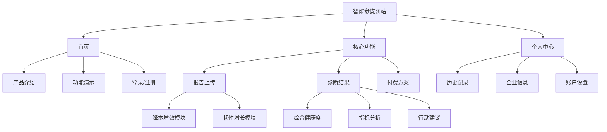
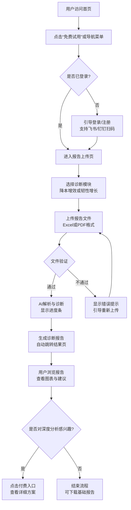

# 智能参谋网站响应式线框图与交互原型设计

## 文档概述

本设计文档基于已完成的诊断框架设计（`docs/诊断框架设计.md`），定义智能参谋网站的整体信息架构、响应式线框图与用户交互流程，为后续前端开发提供明确指导。

**设计目标**：
1. 建立清晰的信息架构，覆盖用户从访问到获取诊断结果的全流程
2. 设计亲和易懂的界面，符合“管理助手”形象，同时保持专业严谨性
3. 确保跨设备响应式体验，PC端与移动端操作流畅一致
4. 为商业化转化设计明确的引导路径（免费诊断→付费方案）

**设计原则**：
- **亲和性**：使用温暖的企业蓝为主色调，圆角卡片，友好文案
- **专业性**：数据可视化清晰准确，咨询建议结构化呈现
- **响应式**：从375px移动端到1920px桌面端全适配
- **可访问性**：符合WCAG 2.1 AA标准，支持键盘导航

---

## 第一章：信息架构设计

### 1.1 网站整体结构



### 1.2 页面导航结构

**主导航菜单（PC端）**：
- 首页
- 降本增效
- 韧性增长
- 我的诊断（登录后显示）
- 登录/注册（未登录时显示）

**移动端导航**：
- 汉堡菜单包含上述所有选项
- 底部导航栏：首页、上传、历史、我的

### 1.3 用户流程

**核心用户流程**：
1. 新用户：访问首页 → 了解功能 → 注册/登录 → 选择模块 → 上传报告 → 查看诊断 → 考虑付费升级
2. 老用户：登录 → 查看历史记录 → 上传新报告 → 查看对比分析 → 管理订阅

**转化路径**：
- 免费用户：每次诊断获得基础报告，包含3个“深度分析”入口
- 付费用户：可查看完整报告，下载PDF，获取定制化建议

---

## 第二章：响应式线框图设计

### 2.1 PC端设计（1920px宽度）

#### 2.1.1 首页（Landing Page）

**布局结构**：
```
┌─────────────────────────────────────────────────────────────────────┐
│ 导航栏：Logo + [首页][降本增效][韧性增长][我的诊断][登录/注册]       │
├─────────────────────────────────────────────────────────────────────┤
│ 英雄区：                                                        │
│  ┌────────────────────────────────────────────────────────────┐  │
│  │ 主标题：企业智能参谋，7x24小时AI诊断助手                     │  │
│  │ 副标题：上传财务/经营报告，获取专业降本增效与韧性增长建议      │  │
│  │ CTA按钮：[免费试用] [观看演示]                              │  │
│  └────────────────────────────────────────────────────────────┘  │
├─────────────────────────────────────────────────────────────────────┤
│ 功能展示区：3列卡片布局                                         │
│ ┌──────────┐ ┌──────────┐ ┌──────────┐                        │
│ │ 降本增效 │ │ 韧性增长 │ │ 行业对比 │                        │
│ │ 图标+描述│ │ 图标+描述│ │ 图标+描述│                        │
│ └──────────┘ └──────────┘ └──────────┘                        │
├─────────────────────────────────────────────────────────────────────┤
│ 操作指引区：三步流程图示                                        │
│ 1.上传报告 → 2.AI诊断 → 3.获取建议                              │
├─────────────────────────────────────────────────────────────────────┤
│ 合作伙伴展示：飞书/钉钉Logo + “生态合作应用”标签                │
├─────────────────────────────────────────────────────────────────────┤
│ 页脚：链接 + 版权信息                                           │
└─────────────────────────────────────────────────────────────────────┘
```

**设计要点**：
- 导航栏固定顶部，滚动时保持可访问
- 英雄区使用渐变背景，突出核心价值主张
- 功能卡片采用悬停效果，增强交互反馈
- 操作指引使用步骤图标，直观展示流程

#### 2.1.2 报告上传页（Upload Page）

**布局结构**：
```
┌─────────────────────────────────────────────────────────────────────┐
│ 导航栏（同首页）                                                  │
├─────────────────────────────────────────────────────────────────────┤
│ 页面标题：选择诊断模块                                           │
│                                                                     │
│ 模块选择卡片：2列布局                                            │
│ ┌────────────────────────┐ ┌────────────────────────┐           │
│ │   降本增效模块         │ │   韧性增长模块         │           │
│ │                        │ │                        │           │
│ │ 图标：💰               │ │ 图标：📈               │           │
│ │ 描述：分析财务报告，识别│ │ 描述：分析经营报告，对│           │
│ │ 成本优化空间          │ │ 标行业标杆，制定增长策略│           │
│ │                        │ │                        │           │
│ │ 支持格式：Excel/PDF   │ │ 支持格式：Excel/PDF   │           │
│ │ 典型用户：制造业、零售业│ │ 典型用户：所有增长期企│           │
│ │                        │ │ 业                     │           │
│ │ [选择此模块]          │ │ [选择此模块]          │           │
│ └────────────────────────┘ └────────────────────────┘           │
├─────────────────────────────────────────────────────────────────────┤
│ （选择模块后显示）                                                │
│ 文件上传区域：                                                   │
│ ┌────────────────────────────────────────────────────────────┐  │
│ │ 拖拽上传区                                                │  │
│ │                                                            │  │
│ │        📁 拖拽财务报告文件到此区域，或                     │  │
│ │           [点击上传]                                      │  │
│ │                                                            │  │
│ │ 支持格式：.xlsx, .xls, .xlsm, .pdf                       │  │
│ │ 最大文件：50MB                                           │  │
│ │ 推荐模板：[下载财务报告模板]                             │  │
│ └────────────────────────────────────────────────────────────┘  │
├─────────────────────────────────────────────────────────────────────┤
│ 历史报告列表（折叠面板）：                                        │
│ ┌────────────────────────────────────────────────────────────┐  │
│ │ 2025年Q4财务报告 - 2026-03-20 14:30                       │  │
│ │ 2025年12月经营报告 - 2026-03-18 09:15                     │  │
│ └────────────────────────────────────────────────────────────┘  │
└─────────────────────────────────────────────────────────────────────┘
```

**设计要点**：
- 模块选择清晰区分，图标与颜色编码（降本增效：蓝色，韧性增长：绿色）
- 上传区域提供明确的操作指引和格式限制
- 历史记录便于快速重新分析
- 模板下载帮助用户准备标准化报告

#### 2.1.3 诊断结果页（Results Page）

**布局结构**：
```
┌─────────────────────────────────────────────────────────────────────┐
│ 导航栏（新增“导出报告”、“分享”按钮）                              │
├─────────────────────────────────────────────────────────────────────┤
│ 报告头信息：                                                     │
│ 企业名称：XX科技有限公司 | 报告期：2025年Q4 | 生成时间：2026-03-24│
│ 诊断模块：降本增效 | 综合健康度：76.5/100 🟢                    │
├─────────────────────────────────────────────────────────────────────┤
│ 第一屏：健康度概览                                               │
│ ┌────────────────────────────────────────────────────────────┐  │
│ │ 环形图：综合得分76.5                                       │  │
│ │ 健康评级：良好                                             │  │
│ │ 趋势箭头：↗ 较上期提升5.2分                               │  │
│ └────────────────────────────────────────────────────────────┘  │
├─────────────────────────────────────────────────────────────────────┤
│ 第二屏：关键指标仪表盘                                           │
│ ┌────────────────────────────────────────────────────────────┐  │
│ │ 雷达图：5个降本增效指标得分                                 │  │
│ │ 条形图：企业vs行业平均值对比                                │  │
│ └────────────────────────────────────────────────────────────┘  │
├─────────────────────────────────────────────────────────────────────┤
│ 第三屏：详细分析                                               │
│ 指标1：成本结构健康度（68.2分）                                │
│   • 您的值：82% | 行业平均：78% | 健康范围：70-85%            │
│   • 问题识别：销售费用占比偏高                                 │
│   • 建议：优化数字营销渠道ROI，降低销售费用占比2-3个百分点     │
│                                                                 │
│ 指标2：毛利率偏差度（...）                                     │
├─────────────────────────────────────────────────────────────────────┤
│ 第四屏：行动建议（按优先级排序）                               │
│ ┌─────────┬─────────────┬────────────┬──────────────┐       │
│ │ 优先级 │ 行动事项    │ 时间线     │ 预期影响     │       │
│ ├─────────┼─────────────┼────────────┼──────────────┤       │
│ │ 高     │ 优化销售费用│ 1-2个月    │ 毛利率+1.5%  │       │
│ │ 中     │ 优化存货管理│ 3-6个月    │ 周转率+15%   │       │
│ └─────────┴─────────────┴────────────┴──────────────┘       │
├─────────────────────────────────────────────────────────────────────┤
│ 第五屏：付费升级入口                                           │
│ ┌────────────────────────────────────────────────────────────┐  │
│ │ 🔒 深度分析仅限付费用户                                    │  │
│ │                                                             │
│ │ 1. 供应链成本结构分析 - ¥499                              │  │
│ │    识别供应商成本优化空间，预计年节省¥150,000              │  │
│ │                                                             │
│ │ 2. 竞争对手对标分析 - ¥799                                │  │
│ │    获取前3名竞争对手详细对比数据                           │  │
│ │                                                             │
│ │ [升级到专业版] | [单独购买深度分析]                        │  │
│ └────────────────────────────────────────────────────────────┘  │
└─────────────────────────────────────────────────────────────────────┘
```

**设计要点**：
- 分层展示：从概览到细节，符合用户阅读习惯
- 可视化优先：使用图表直观呈现数据
- 行动导向：建议具体可执行，含预期收益
- 商业化引导：自然融入付费入口，提供明确价值主张

### 2.2 移动端设计（375px宽度）

#### 2.2.1 首页移动端

**布局变化**：
- 导航栏替换为汉堡菜单
- 英雄区标题字体缩小，CTA按钮垂直排列
- 功能展示区改为垂直单列，卡片宽度100%
- 操作指引区改为垂直步骤，图标在上文字在下
- 合作伙伴Logo水平滚动展示

**交互细节**：
- 汉堡菜单从左侧滑出
- 卡片点击区域确保≥44×44px（苹果人机指南）
- 底部添加固定导航栏（首页、上传、历史、我的）

#### 2.2.2 报告上传页移动端

**布局变化**：
- 模块选择改为垂直排列，卡片宽度100%
- 文件上传区域高度适当缩小，保持操作区域足够
- 历史记录改为下拉选择器，节省空间
- “下载模板”按钮置于上传区域下方

**交互细节**：
- 拖拽功能在移动端替换为点击上传
- 文件选择后显示文件名和大小
- 上传进度条显示在页面顶部

#### 2.2.3 诊断结果页移动端

**布局变化**：
- 报告头信息垂直排列，每项一行
- 健康度环形图适当缩小，但保持可读性
- 雷达图与条形图改为垂直堆叠，交互式查看（可左右滑动切换）
- 详细分析每个指标折叠显示，点击展开
- 行动建议表格改为卡片列表
- 付费升级入口保持醒目，按钮宽度100%

**交互细节**：
- 图表支持手势缩放（双指缩放）
- 长按图表可显示具体数值
- 页面支持下拉刷新重新计算

---

## 第三章：交互流程设计

### 3.1 正常流程：用户成功获取诊断报告



### 3.2 异常处理流程

#### 3.2.1 文件格式错误

**触发条件**：用户上传非支持格式（如.jpg, .doc）
**系统响应**：
1. 立即验证文件扩展名
2. 显示红色提示框：“不支持的文件格式，请上传Excel(.xlsx/.xls)或PDF(.pdf)文件”
3. 显示支持格式列表
4. 上传区域重置，允许重新选择

#### 3.2.2 文件大小超标

**触发条件**：文件>50MB
**系统响应**：
1. 上传前检测文件大小
2. 显示提示：“文件大小超过50MB限制，请压缩或分割文件”
3. 提供建议：“推荐只上传关键财务报表，或联系客服处理大文件”

#### 3.2.3 数据解析失败

**触发条件**：AI无法提取关键字段
**系统响应**：
1. 显示解析失败页面
2. 提供可能的失败原因：
   - 报告格式非标准
   - 扫描PDF质量差
   - 数据缺失严重
3. 提供解决方案：
   - [下载标准模板]重新填写
   - [使用示例文件]体验功能
   - [联系人工协助]（付费用户）

#### 3.2.4 网络中断

**触发条件**：上传或解析过程中断网
**系统响应**：
1. 检测网络状态，显示“网络连接已断开”
2. 自动保存已上传的文件到本地（localStorage）
3. 提供“恢复上传”按钮，网络恢复后继续
4. 超过30分钟未恢复则清除本地缓存，需重新上传

### 3.3 加载状态设计

**文件上传中**：
- 显示进度条（0-100%）
- 显示预估剩余时间
- 允许取消上传

**AI解析中**：
- 显示加载动画，文案：“正在解析财务报告，通常需要10-30秒”
- 显示进度阶段：文件读取 → 数据提取 → 指标计算 → 生成建议

**诊断生成中**：
- 显示加载动画，文案：“AI正在生成专业诊断建议”
- 显示趣味文案轮播，缓解等待焦虑

### 3.4 数据验证规则

**前端验证（实时）**：
- 文件类型：`.xlsx`, `.xls`, `.xlsm`, `.pdf`
- 文件大小：≤50MB
- 文件名：不能包含特殊字符`<>:"/\|?*`

**后端验证（上传后）**：
- 文件完整性：校验文件是否损坏
- 内容可读性：确保文本可提取
- 数据完整性：检查必需字段是否存在
- 数值合理性：验证金额、比率在合理范围内

---

## 第四章：视觉与交互规范

### 4.1 设计系统核心参数

**颜色体系**：
- 主色调：企业蓝 `#2A5CAA`
- 辅助色：增长绿 `#28A745`、警示红 `#DC3545`
- 中性色：深灰 `#333333`、中灰 `#666666`、浅灰 `#F8F9FA`
- 图表配色：ColorBrewer Set3（保证色盲友好）

**字体系统**：
- 英文：Inter（无衬线，现代感）
- 中文：Noto Sans CJK SC（思源黑体）
- 字号阶梯：12, 14, 16, 20, 24, 32, 48px
- 行高：1.5倍（正文），1.2倍（标题）

**间距系统**：
- 基础单位：8px
- 间距值：8, 16, 24, 32, 48, 64, 96px
- 卡片内边距：24px（PC），16px（移动）

**圆角系统**：
- 小圆角：4px（按钮、输入框）
- 中圆角：8px（卡片）
- 大圆角：16px（模态框）

### 4.2 组件库规范

**按钮**：
- 主要按钮：蓝底白字，圆角8px，悬停加深
- 次要按钮：白底蓝字，边框，悬停背景变浅
- 文字按钮：蓝色文字，无背景，用于次要操作

**卡片**：
- 阴影：0 2px 8px rgba(0,0,0,0.08)
- 背景：白色
- 悬停效果：阴影加深，轻微上移

**表单**：
- 标签在上，输入框在下
- 错误状态：红色边框+下方错误提示
- 成功状态：绿色边框+对勾图标

**图表容器**：
- 白色背景，1px灰色边框
- 标题在左上，图例在右上（PC）/下方（移动）
- 支持工具栏：下载、全屏、刷新

### 4.3 动效规范

**页面过渡**：
- 淡入淡出：300ms缓动
- 滑动进入：从右侧滑入，400ms缓动

**微交互**：
- 按钮点击：缩放95%，100ms
- 卡片悬停：上移4px，200ms缓动
- 加载动画：旋转，线性无限

**反馈动效**：
- 成功：对勾图标+缩放
- 错误：晃动输入框
- 提示：从顶部滑入通知

---

## 第五章：技术实现要点

### 5.1 响应式实现方案

**断点设置**：
- 移动端：< 768px
- 平板端：768px - 1024px
- 桌面端：≥ 1024px

**布局技术**：
- CSS Grid：复杂多列布局
- Flexbox：简单对齐布局
- 媒体查询：断点适配

**图片响应式**：
- `srcset`属性：不同分辨率图片
- `picture`元素：不同设备图片
- 懒加载：滚动加载

### 5.2 前端技术栈推荐

**基础框架**：
- Vue 3 + Composition API（轻量、易上手）
- 或 React 18 + TypeScript（生态丰富）

**UI组件库**：
- Naive UI（Vue）或 Ant Design（React）
- 配合ECharts 5数据可视化

**状态管理**：
- Pinia（Vue）或 Redux Toolkit（React）
- 配合localStorage持久化

**构建工具**：
- Vite：快速开发，热更新
- 部署：Vercel（推荐）或 Netlify

### 5.3 交互实现细节

**文件上传**：
- 使用`<input type="file">`配合拖拽库（如vue-dropzone）
- 分块上传（大文件）
- 断点续传（localStorage记录进度）

**图表交互**：
- ECharts配置响应式resize
- 移动端手势支持（hammer.js或原生）
- 数据更新动画过渡

**错误边界**：
- React Error Boundary或Vue errorCaptured
- 用户友好错误页面
- 错误日志自动上报

---

## 第六章：验收标准核对表

- [x] **信息架构完整**：文档包含完整的信息架构图，清晰展示网站页面结构
- [x] **PC端线框图**：覆盖至少3个关键页面（首页、报告上传页、诊断结果页），详细描述布局
- [x] **移动端线框图**：覆盖相同3个关键页面，说明响应式适配变化
- [x] **交互流程详细**：包含正常流程和异常处理（文件格式错误、大小超标、解析失败、网络中断）
- [x] **输出路径正确**：文档保存至 `docs/网站设计/线框图与交互原型.md`，目录结构正确
- [x] **设计风格符合**：亲和易懂的助手形象，同时保持专业咨询公司的内容严谨性

---

## 第七章：后续工作建议

### 7.1 设计资产交付

**待交付文件**：
1. **Figma设计稿**：包含所有页面、组件、交互状态
2. **设计标注文档**：尺寸、颜色、字体、间距的详细标注
3. **图标资源包**：SVG格式，按模块分类
4. **动效示例**：Lottie或视频文件

### 7.2 开发协作要点

**设计-开发交接**：
1. 设计评审会：确保开发理解交互细节
2. 组件验收标准：每个组件需满足的交互要求
3. 适配测试清单：重点测试的设备和场景

**测试重点**：
1. 文件上传：各格式、各大小、网络中断恢复
2. 图表展示：数据更新、手势操作、性能
3. 响应式：折叠菜单、表格适配、字体缩放

### 7.3 迭代计划

**MVP阶段（第1周）**：
- 实现首页、报告上传页、诊断结果页基础功能
- 完成PC端适配，移动端基础体验

**优化阶段（第2周）**：
- 完善响应式细节，优化移动端交互
- 增加加载状态、错误处理、空状态

**扩展阶段（第3-4周）**：
- 增加个人中心、历史记录、设置页面
- 优化性能，添加PWA支持

---

## 附录

### 附录A：页面状态定义

**加载状态**：
- 初始加载：骨架屏
- 数据加载：进度条+文案
- 内容加载：占位图

**错误状态**：
- 轻量错误：Toast提示
- 中度错误：页面内提示区
- 严重错误：全屏错误页

**空状态**：
- 无数据：引导操作
- 无结果：提供建议
- 无权限：引导升级

### 附录B：浏览器兼容性要求

**必须支持**：
- Chrome 90+、Safari 14+、Firefox 88+、Edge 90+
- iOS 13+、Android 9+

**渐进增强**：
- 现代浏览器：完整功能
- 老旧浏览器：基础功能可用

### 附录C：相关文件索引

1. 诊断框架设计：`docs/诊断框架设计.md`
2. 竞品分析报告：`docs/竞品分析.md`
3. 生态合作方案：`docs/生态合作方案.md`
4. 财务模型：`docs/财务模型.xlsx`

---

*文档版本：v1.0*  
*生成日期：2026年3月24日*  
*更新记录：初始版本，基于诊断框架设计*  
*保密级别：内部使用*