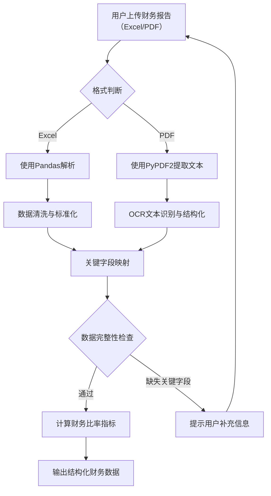

# 智能参谋平台诊断框架设计

## 文档概述

本设计文档基于已完成的市场竞品分析（`docs/竞品分析.md`）与生态合作方案（`docs/生态合作方案.md`），定义智能参谋平台的核心诊断框架。文档旨在为后续开发提供清晰的逻辑流程、指标体系与技术实现要点。

**设计目标**：
1. 建立标准化的财务报告与经营报告解析流程
2. 定义可量化的诊断指标体系，覆盖降本增效与韧性增长两大模块
3. 确保诊断结果兼具专业准确性与用户易理解性
4. 为AI集成提供结构化数据输入与输出规范

---

## 第一章：财务报告解析逻辑设计

### 1.1 解析目标
从企业上传的Excel/PDF格式财务报告中，自动提取关键财务数据，识别成本结构问题，为降本增效模块提供量化分析基础。

### 1.2 关键数据字段定义
系统需从三大财务报表中提取以下核心字段：

| 报表类型 | 关键字段 | 字段说明 | 数据示例 |
|---------|---------|---------|---------|
| **利润表** | 营业收入 | 主营业务收入总额 | 5,000,000 |
| | 营业成本 | 直接成本总额 | 3,000,000 |
| | 销售费用 | 市场推广、销售人员费用 | 500,000 |
| | 管理费用 | 行政、管理人员费用 | 300,000 |
| | 财务费用 | 利息支出等 | 100,000 |
| | 净利润 | 税后净利润 | 800,000 |
| **资产负债表** | 货币资金 | 现金及现金等价物 | 1,200,000 |
| | 应收账款 | 未收回的销售款项 | 800,000 |
| | 存货 | 库存商品、原材料 | 600,000 |
| | 流动资产合计 | 短期可变现资产 | 2,800,000 |
| | 固定资产 | 长期使用的资产 | 3,500,000 |
| | 流动负债合计 | 一年内需偿还的债务 | 1,500,000 |
| | 所有者权益 | 净资产价值 | 4,500,000 |
| **现金流量表** | 经营活动现金净流量 | 主营业务的现金流入净额 | 900,000 |
| | 投资活动现金净流量 | 投资相关的现金流动 | -200,000 |
| | 筹资活动现金净流量 | 融资相关的现金流动 | 100,000 |

### 1.3 标准化解析流程



**步骤详解**：

1. **格式识别与解析**：
   - **Excel文件**：使用Pandas库读取，支持.xlsx、.xls、.xlsm格式。自动检测工作表名称，优先查找“利润表”、“资产负债表”、“现金流量表”等标准命名。
   - **PDF文件**：使用PyPDF2提取文本内容，针对扫描版PDF可集成第三方OCR服务（如百度OCR/阿里云OCR）。

2. **数据清洗与标准化**：
   - 统一金额单位（万元/元标准化）
   - 处理合并单元格、多级表头等非标准格式
   - 识别并修复负号表示（如“-”表示支出）
   - 时间字段标准化（会计期间识别）

3. **关键字段映射**：
   - 建立同义词映射表：如“营业收入”可能表述为“主营业务收入”、“销售收入”等
   - 支持自定义字段映射：允许用户手动标注关键数据位置（MVP后期功能）

4. **数据完整性校验**：
   - 必须字段：营业收入、营业成本、三费（销售/管理/财务费用）、净利润
   - 可选字段：资产、负债、现金流数据
   - 校验规则：数值合理性（如费用不应大于收入）、时间连续性等

### 1.4 技术实现要点

| 技术组件 | 推荐方案 | 说明 |
|---------|---------|------|
| **前端文件解析** | SheetJS（Excel） + PDF.js | 浏览器端轻量级解析，减少服务器压力 |
| **后端数据处理** | Pandas + Openpyxl | 复杂格式处理与数据清洗 |
| **PDF OCR** | 阿里云OCR API（免费额度） | 支持扫描件识别，准确率>95% |
| **数据存储** | localStorage（临时） + Supabase（长期） | 用户会话数据本地存储，诊断结果云端备份 |

---

## 第二章：经营报告解析逻辑设计

### 2.1 解析目标
从企业上传的月度/年度经营报告中，提取关键业务指标，分析增长趋势，对比行业标杆数据，为韧性增长模块提供策略建议基础。

### 2.2 关键指标字段定义

| 指标类别 | 关键指标 | 指标说明 | 数据来源 |
|---------|---------|---------|---------|
| **增长指标** | 营收增长率 | (本期营收-上期营收)/上期营收 | 利润表时间序列 |
| | 客户增长率 | (本期客户数-上期客户数)/上期客户数 | 客户数据表 |
| | 市场份额 | 企业营收/行业总规模 | 外部数据接口 |
| **效率指标** | 人均营收 | 营业收入/员工总数 | 人力数据表 |
| | 客户留存率 | 期末留存客户/期初总客户 | CRM系统 |
| | 客户满意度 | NPS或五星评分均值 | 调研数据 |
| **质量指标** | 产品退货率 | 退货数量/销售总量 | 质量报表 |
| | 项目交付准时率 | 准时交付项目数/总项目数 | 项目管理表 |
| | 员工流失率 | 离职员工数/平均员工数 | HR报表 |

### 2.3 行业标杆数据对比方法

**数据来源策略**：

1. **公开数据源**：
   - 国家统计局行业数据
   - 上市公司财报（同行业）
   - 行业协会发布报告

2. **合作数据源**：
   - 飞书/钉钉生态内企业脱敏数据（需用户授权）
   - 第三方数据服务商（如企查查、天眼查行业报告）

3. **平台自建标杆库**：
   - 基于已服务企业的匿名化数据积累
   - 定期更新行业平均值、优秀值、警示值

**对比分析流程**：

1. **行业匹配**：根据企业主营业务识别行业分类（参考国民经济行业分类GB/T 4754）
2. **规模分层**：按营收规模将企业分为微型（<300万）、小型（300-2000万）、中型（2000-40000万）、大型（>40000万）
3. **标杆选取**：为每个行业×规模层级选取合适的对比标杆
4. **差距量化**：计算企业指标与行业平均、行业优秀值的相对差距

### 2.4 技术实现要点

| 技术挑战 | 解决方案 | 实施阶段 |
|---------|---------|---------|
| **经营报告格式多样** | 预置10个行业标准模板，引导用户按模板填写 | MVP阶段 |
| **行业数据获取** | 集成阿里云行业数据API（免费试用） | MVP阶段 |
| **实时对比计算** | 前端缓存行业标杆数据，减少API调用 | 优化阶段 |
| **多源数据融合** | 建立统一指标计算引擎，支持自定义公式 | 扩展阶段 |

---

## 第三章：诊断指标体系设计

### 3.1 设计原则

1. **可量化**：每个指标有明确计算公式与数据来源
2. **可解释**：指标结果能直观反映企业经营健康度
3. **可行动**：指标异常能直接对应改善建议
4. **可比较**：支持跨时间、跨行业、跨规模对比

### 3.2 降本增效模块诊断指标（5个）

| 指标名称 | 计算公式 | 健康范围 | 异常解读 |
|---------|---------|---------|---------|
| **成本结构健康度** | (营业成本+三费)/营业收入 | 制造业:70-85%<br>服务业:60-75% | >上限：成本过高，需优化<br><下限：可能投入不足 |
| **毛利率偏差度** | (企业毛利率-行业平均毛利率)/行业平均毛利率 | -10% ~ +15% | <-10%：竞争力不足<br>>+15%：可能定价过高 |
| **费用控制效率** | (本期三费-上期三费)/上期三费 | -5% ~ +10% | >+10%：费用增长过快<br><-5%：可能过度压缩 |
| **人力成本占比** | 人力成本/营业收入 | 制造业:15-25%<br>互联网:25-40% | >上限：人力效率低<br><下限：可能人才不足 |
| **存货周转健康度** | 企业存货周转率/行业平均周转率 | 0.8 ~ 1.2 | <0.8：库存积压<br>>1.2：可能缺货风险 |

**指标详细说明**：

1. **成本结构健康度**：
   - **数据来源**：利润表（营业成本、销售费用、管理费用、财务费用、营业收入）
   - **计算频率**：月度/季度
   - **行业差异**：不同行业成本结构差异显著，需按行业设定基准

2. **毛利率偏差度**：
   - **行业数据获取**：通过公开财报数据计算行业平均
   - **时间窗口**：最近12个月滚动平均
   - **规模调整**：按企业规模层级进行同层对比

3. **费用控制效率**：
   - **三费定义**：销售费用、管理费用、财务费用
   - **季节性调整**：考虑行业季节性波动
   - **通胀调整**：建议按CPI进行名义值调整

4. **人力成本占比**：
   - **人力成本构成**：工资、社保、福利、培训等
   - **效率关联**：与人均营收指标联合分析
   - **地域差异**：一线城市与二三线城市基准不同

5. **存货周转健康度**：
   - **存货周转率**：营业成本/平均存货余额
   - **行业特点**：制造业关注原材料、在制品、产成品分层分析
   - **供应链影响**：与供应商付款账期联合分析

### 3.3 韧性增长模块诊断指标（5个）

| 指标名称 | 计算公式 | 健康范围 | 异常解读 |
|---------|---------|---------|---------|
| **营收增长动力指数** | (企业营收增长率-行业平均增长率)/行业平均增长率 | -5% ~ +20% | <-5%：增长乏力<br>>+20%：可持续性存疑 |
| **市场份额变化率** | (本期市场份额-上期市场份额)/上期市场份额 | >0% | <0%：市场地位下滑 |
| **客户留存健康度** | 企业客户留存率/行业平均留存率 | 0.9 ~ 1.1 | <0.9：客户流失严重<br>>1.1：客户粘性优秀 |
| **组织效能指数** | 企业人均营收/行业平均人均营收 | 0.8 ~ 1.5 | <0.8：组织效率低<br>>1.5：可能人力不足 |
| **抗风险能力指数** | (货币资金+短期投资)/月均营业成本 | >3个月 | <3个月：现金流紧张 |

**指标详细说明**：

1. **营收增长动力指数**：
   - **增长质量分析**：区分有机增长与并购增长
   - **季度平滑**：使用移动平均消除季度波动
   - **增长驱动**：分析增长主要来自新客户还是老客户

2. **市场份额变化率**：
   - **市场定义**：明确地理范围与产品范围
   - **数据滞后**：行业总规模数据通常有3-6个月滞后
   - **竞争监测**：监测主要竞争对手份额变化

3. **客户留存健康度**：
   - **客户分层**：按客户价值分层计算留存率
   - **流失预警**：建立早期流失预警模型
   - **挽回分析**：分析流失客户特征与挽回成本

4. **组织效能指数**：
   - **效能分解**：分析营销效率、研发效率、运营效率
   - **数字化影响**：评估数字化工具对效能提升贡献
   - **文化因素**：考虑组织文化对效能的影响权重

5. **抗风险能力指数**：
   - **压力测试**：模拟营收下降20%情景下的现金流
   - **债务结构**：分析短期债务比例与偿债压力
   - **应急计划**：评估企业是否有正式的风险应急计划

### 3.4 指标权重与综合评分

**权重分配原则**：
- 行业特性：不同行业指标重要性不同
- 企业阶段：初创期更关注增长，成熟期更关注成本
- 风险偏好：保守型 vs 进取型管理风格

**综合健康度评分公式**：
```
综合得分 = Σ(指标得分 × 指标权重)
指标得分 = 标准化(实际值, 健康范围下限, 健康范围上限)
```

**标准化方法**：
- 正向指标（越高越好）：得分 = (实际值 - 下限)/(上限 - 下限) × 100
- 逆向指标（越低越好）：得分 = (上限 - 实际值)/(上限 - 下限) × 100
- 区间指标（适中最好）：计算偏离度，得分 = 100 - 偏离度×权重

---

## 第四章：数据映射与输出规范

### 4.1 输入数据映射表

**财务报告标准输入格式**：

```json
{
  "report_type": "financial",
  "period": "2025-Q4",
  "currency": "CNY",
  "units": "万元",
  "income_statement": {
    "revenue": 5000.0,
    "cost_of_goods_sold": 3000.0,
    "gross_profit": 2000.0,
    "sales_expenses": 500.0,
    "administrative_expenses": 300.0,
    "financial_expenses": 100.0,
    "net_profit": 800.0
  },
  "balance_sheet": {
    "cash_and_equivalents": 1200.0,
    "accounts_receivable": 800.0,
    "inventory": 600.0,
    "current_assets": 2800.0,
    "fixed_assets": 3500.0,
    "current_liabilities": 1500.0,
    "equity": 4500.0
  },
  "cash_flow": {
    "operating_cash_flow": 900.0,
    "investing_cash_flow": -200.0,
    "financing_cash_flow": 100.0
  }
}
```

**经营报告标准输入格式**：

```json
{
  "report_type": "operational",
  "period": "2025-12",
  "industry": "制造业/电子设备",
  "scale": "中型",
  "growth_metrics": {
    "revenue_growth_rate": 0.15,
    "customer_growth_rate": 0.12,
    "market_share": 0.032
  },
  "efficiency_metrics": {
    "revenue_per_employee": 85.6,
    "customer_retention_rate": 0.78,
    "customer_satisfaction_score": 4.2
  },
  "quality_metrics": {
    "product_return_rate": 0.015,
    "project_on_time_rate": 0.92,
    "employee_turnover_rate": 0.18
  }
}
```

### 4.2 诊断输出规范

**标准诊断报告结构**：

```json
{
  "report_id": "DIAG-20250324-001",
  "generated_at": "2026-03-24T09:30:00Z",
  "module": "cost_reduction",
  "overall_score": 76.5,
  "health_level": "良好",
  "key_findings": [
    {
      "indicator": "成本结构健康度",
      "score": 68.2,
      "trend": "改善",
      "insight": "成本结构略高于行业平均水平，主要来自销售费用占比偏高",
      "recommendation": "建议优化数字营销渠道ROI，将销售费用占比降低2-3个百分点"
    }
  ],
  "detailed_analysis": {
    "indicators": [...],
    "benchmark_comparison": [...],
    "trend_analysis": [...]
  },
  "action_plan": [
    {
      "priority": "高",
      "action": "优化销售费用结构",
      "timeline": "1-2个月",
      "expected_impact": "毛利率提升1.5%"
    }
  ],
  "upgrade_opportunities": [
    {
      "title": "深度供应链分析",
      "description": "分析供应商成本结构，识别降本空间",
      "price": "¥499",
      "estimated_value": "年节省成本约¥150,000"
    }
  ]
}
```

### 4.3 可视化输出要求

1. **健康度仪表盘**：
   - 综合得分环形图
   - 各模块得分雷达图
   - 趋势变化折线图

2. **对比分析图表**：
   - 行业标杆对比条形图
   - 历史趋势对比折线图
   - 成本结构堆叠面积图

3. **行动计划甘特图**：
   - 按优先级排序的行动时间线
   - 预期收益标注

**技术实现**：使用ECharts技能生成交互式图表，支持PC与移动端自适应。

---

## 第五章：实施路线与验收标准

### 5.1 分阶段实施计划

| 阶段 | 核心任务 | 交付物 | 时间节点 |
|------|---------|--------|---------|
| **MVP阶段** | 1. 实现Excel财务报告基础解析<br>2. 开发5个降本增效诊断指标<br>3. 集成DeepSeek API生成建议 | 1. 文件解析模块<br>2. 指标计算引擎<br>3. 基础诊断报告模板 | 第2周末 |
| **扩展阶段** | 1. 支持PDF格式报告<br>2. 开发韧性增长5个指标<br>3. 集成行业标杆数据API | 1. PDF解析模块<br>2. 完整指标体系<br>3. 对比分析功能 | 第3周末 |
| **优化阶段** | 1. 增加自定义指标功能<br>2. 优化AI建议准确性<br>3. 完善可视化输出 | 1. 用户配置界面<br>2. 诊断准确率>85%<br>3. 丰富图表类型 | 第4周末 |

### 5.2 验收标准核对表

- [x] **财务报告解析逻辑**：文档包含详细步骤与关键字段列表
- [x] **经营报告解析逻辑**：文档包含详细步骤与对比标杆方法  
- [x] **降本增效模块指标**：至少定义5个诊断指标，每个指标有计算公式
- [x] **韧性增长模块指标**：至少定义5个诊断指标，每个指标有计算公式
- [x] **文档结构**：清晰完整，保存路径为 `docs/诊断框架设计.md`

### 5.3 后续工作建议

1. **技术选型确认**：
   - 前端：Vue 3 + Naive UI + ECharts
   - 后端：Vercel Serverless Functions + Supabase
   - AI服务：DeepSeek API（性价比最高）

2. **开发优先级**：
   - P0：Excel解析 + 5个降本增效指标
   - P1：PDF解析 + 5个韧性增长指标  
   - P2：行业标杆对比 + 可视化图表
   - P3：用户自定义 + 高级分析

3. **风险控制**：
   - AI幻觉：建立专家校验机制（抽样人工复核）
   - 数据安全：前端解析为主，敏感信息脱敏处理
   - 性能瓶颈：分批加载大型报告，优化API调用

---

## 附录

### 附录A：财务报告常见格式示例

**制造业利润表示例**：
| 项目 | 本期金额（万元） | 上期金额（万元） |
|------|----------------|----------------|
| 一、营业收入 | 5,000.00 | 4,500.00 |
| 减：营业成本 | 3,000.00 | 2,800.00 |
| 销售费用 | 500.00 | 450.00 |
| 管理费用 | 300.00 | 280.00 |
| 财务费用 | 100.00 | 90.00 |
| 三、营业利润 | 1,100.00 | 880.00 |
| 四、利润总额 | 1,080.00 | 860.00 |
| 五、净利润 | 800.00 | 650.00 |

### 附录B：行业分类参考

| 行业大类 | 细分行业 | 典型企业规模 |
|---------|---------|-------------|
| 制造业 | 电子设备、机械设备、纺织服装 | 中型为主 |
| 服务业 | 信息技术、商务服务、文化娱乐 | 小型为主 |
| 零售业 | 批发零售、电子商务、连锁经营 | 微型-中型 |

### 附录C：相关文件索引

1. 竞品分析报告：`docs/竞品分析.md`
2. 生态合作方案：`docs/生态合作方案.md`
3. 财务模型：`docs/财务模型.xlsx`
4. 开发规范：`src/开发规范.md`（待创建）

---

*文档版本：v1.0*  
*生成日期：2026年3月24日*  
*更新记录：初始版本*  
*保密级别：内部使用*